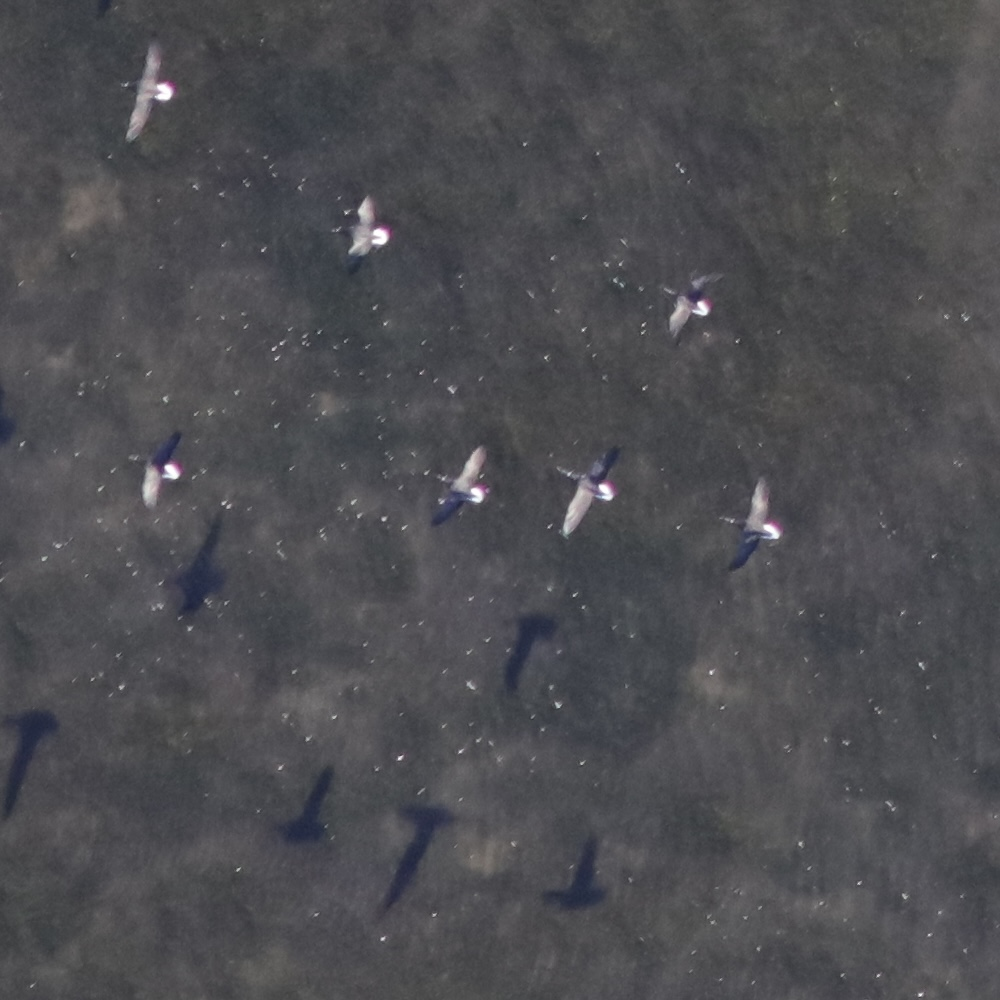
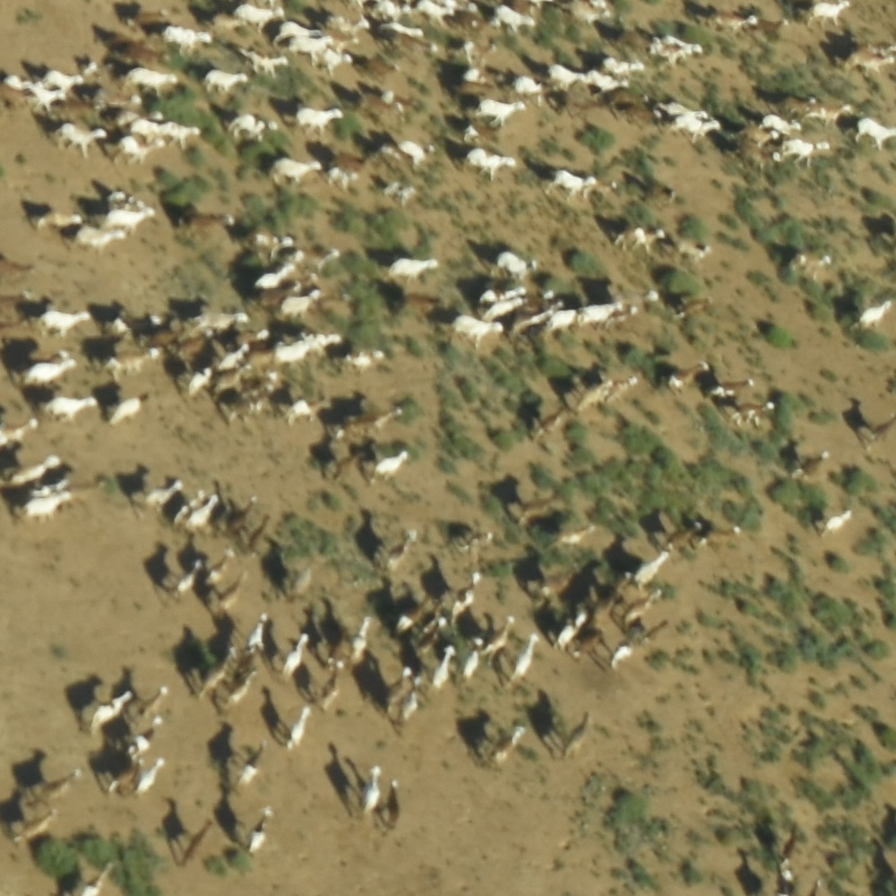
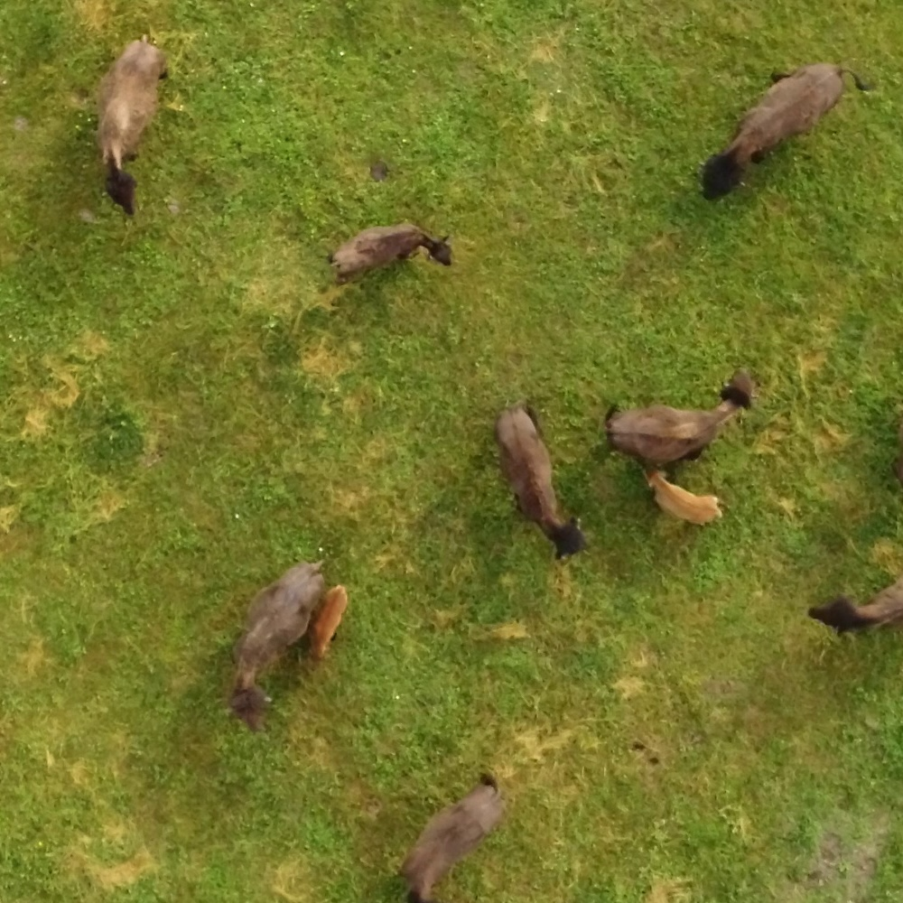
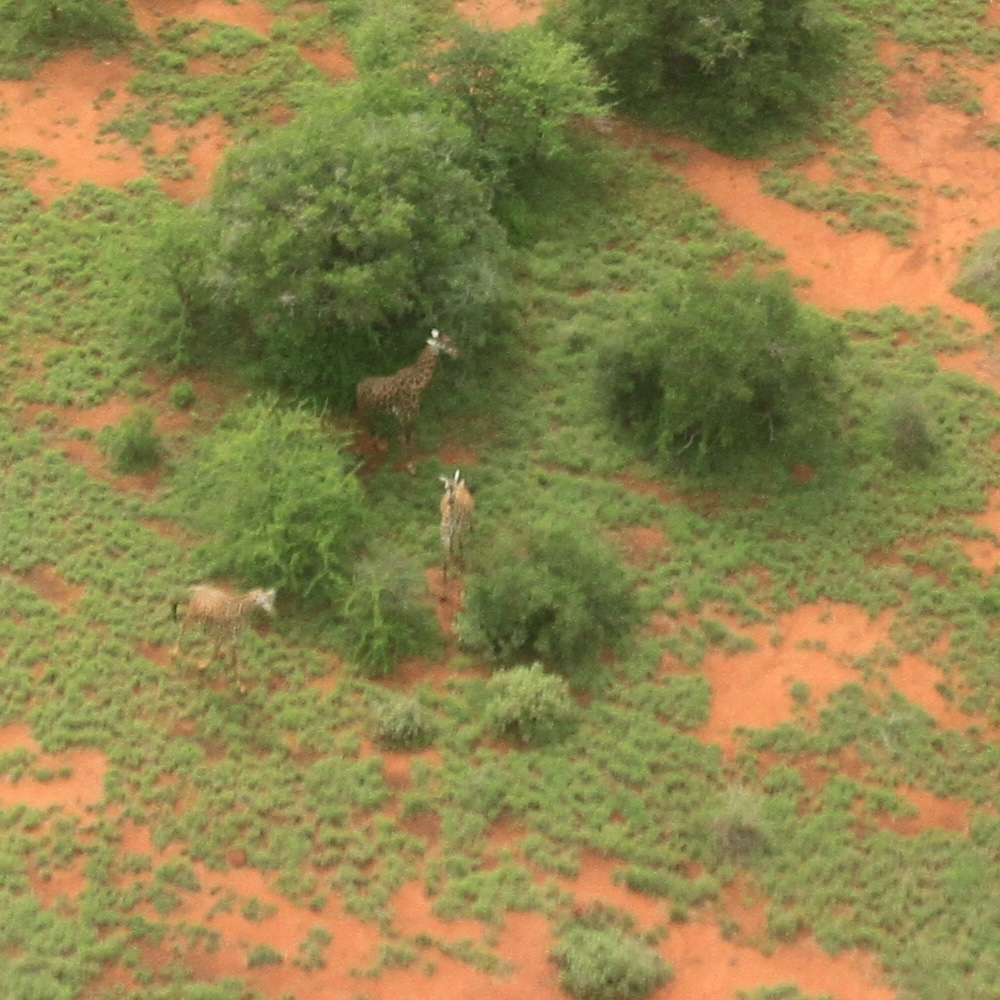

# How-to-Minimize-the-Annotation-Cost-in-Aerial-Wildlife-Surveys
GitHub repo for the paper "How to Minimize the Annotation  Cost in Aerial Wildlife Surveys". In our paper we compare three deep learning architectures (one localization model, HerdNet, and two object detection models, YOLO and POLO) with respect to their ability of detecting animals from aerial imagery. Our experiments are conducted on four diverse datasets containing various animal species, environments, degrees of animal density, camera angles, and taken at different altitudes (cf. pictures below; abbreviations can be found in the paper). We look at the effect of label complexity (i.e., hand-crafted bounding boxes vs. auto-generaterd pseudo-boxes vs. point labels) on detection accuracy and counting performance. We find:
- Wildlife counting accuracy is largely maintained at reduced label complexity
- Counting accuracy is robust towards variations in the size of pseudo box labels 
- Current detection models perform better on oblique images than previous architectures


<div align="center">

<table>
  <tr>
    <td align="center">
      <br>
      <em>EW-IL22</em>
    </td>
    <td align="center">
      <br>
      <em>AD-ENCR23</em>
    </td>
  </tr>
  <tr>
    <td align="center">
      <br>
      <em>BK-L23</em>
    </td>
    <td align="center">
      <br>
      <em>JE-TL19</em>
    </td>
  </tr>
</table>

</div>


This repo is intended to help users reproduce our results, and provide tools for running inference with trained models. For instructions on model training, we kindly refer the reader to the [POLO](https://github.com/gigumay/POLO) and [HerdNet](https://github.com/Alexandre-Delplanque/HerdNet) GitHub repositories. All model weights are available on [Zenodo](https://zenodo.org/records/15399623). We uploaded the test sets we used to measure model performance to the same Zenodo repository, except for the test images of the AD-ENCR23 dataset, as these cannot be made publicly available. 

## Setup
To run the code in this repository, please download the `how2minimize_linux.yml` file if you are on Linux, or `how2minimize_win.yml` on Windows, and then execute:
```
conda env create -f how2minimize.yml
```
or 
```
conda env create -f how2minimize_win.yml
```
This will create a conda environment with (almost) all necessary packages. Subsequently, please run:
```
conda activate how2minimize
```
```
pip install git+https://github.com/gigumay/POLO.git#egg=ultralytics
```
```
pip install git+https://github.com/Alexandre-Delplanque/HerdNet#egg=animaloc
```

Currently, we do not provide a .yml setup file for MacOS users. 

## General Information
- The notebook `inference_YOLO_POLO.ipynb` contains step-by-step instructions for running inference using trained YOLO/POLO models.
- The notebook `inference_HN.ipynb` follows the same idea but for HerdNet models.
- The utils folder contains functionalities necessary for running inference and evaluating the result:
    - `data_params.py`: Contains a dictionary that maps data set abbreviations to data parameters such as, class names, radii, patch overlap, DoR-threshold, etc.
    - `globs.py`: Contains global variables used across files in the folder.
    - `HN.py`: Implements converting HerdNet output to a format that can be run through the evaluation pipeline.
    - `inference_POLO.py`: Implements functionalities to run infernece with POLO models.
    - `model_eval_py`: Methods to evaluate detection results (compute preecision, recall, MAE, ...).
    - `processing_utils.py`: Additional processing functionalities.
- We run tiled inference, i.e., we split an image into overlapping patches, perform inference on these patches and then aggregate all patch-level predictions into a single set of image level predictions. [This helps with detecting small objects, as it increases the relative size of objects](https://openaccess.thecvf.com/content_CVPRW_2019/papers/UAVision/Unel_The_Power_of_Tiling_for_Small_Object_Detection_CVPRW_2019_paper.pdf). 
### Questions?
For anything regarding the code or the paper, please reach out to: gigumay@gmail.com
