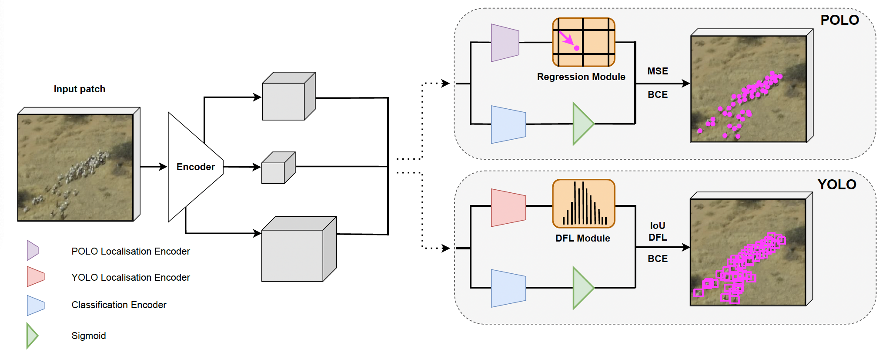
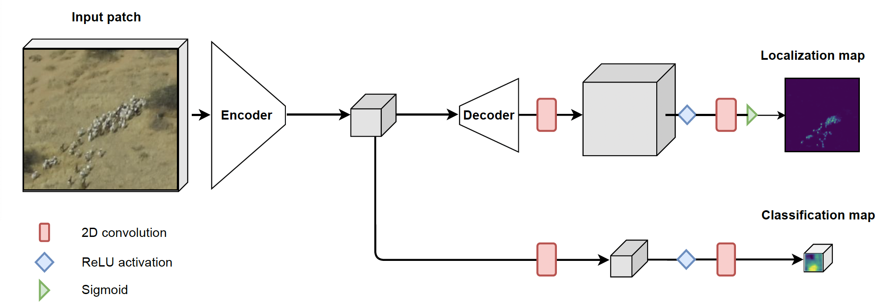

# How-to-Minimize-the-Annotation-Cost-of-Aerial-Wildlife-Censuses
GitHub repo for the paper "How to Minimize the Annotation  Cost of Aerial Wildlife Censuses". In our paper we compare three deep learning architectures (one localization model, HerdNet, and two object detection models, YOLO and POLO; cf. below picture) with respect to their ability of detectinganimals from aerial imagery. Our experiments are conducted on four diverse datasets containing various animal species, environments, degrees of animal density, camera angles, and taken at different altitudes. We look at the effect of label complexity (i.e., hand-crafted bounding boxes vs. auto-generaterd pseudo-boxes vs. point labels) on detection accuracy and counting performance. We find:
- Wildlife counting accuracy is largely maintained at reduced label complexity
- Counting accuracy is robust towards variations in the size of pseudo box labels 
- Current detection models perform better on oblique images than previous architectures


|  | 
|:--:| 
| *Our detection models: YOLO & POLO* |
|  | 
| *Our localization model: HerdNet* |

This repo is intended to help users reproduce our results, and to provide tools for running inference with trained models. For instructions on model training, we kindly refer the reader to the [POLO](https://github.com/gigumay/POLO) and [HerdNet](https://github.com/Alexandre-Delplanque/HerdNet) GitHub repositories. All model weights are available on [Zenodo](https://zenodo.org/records/15399623). We uploaded the test sets we used to measure model performance to the same Zenodo repository, except for the test images of the AD-ENCR23 dataset, as these cannot be made publicly available. 

## Setup
To run the code in this repository, please download the `how2minimize.yml` file and then execute:
```
conda env create -f how2minimize.yml
```
This will create a conda environment with (almost) all necessary packages. Subseqeuntly, please run:
```
conda activate how2minimize
```
```
pip install git+https://github.com/gigumay/POLO.git#egg=ultralytics
```

## General Information
- The notebook `inference_YOLO_POLO.ipynb` contains step-by-step instructions for running inference using trained YOLO/POLO models... FINISH ONCE I GET UPDATE FROM ALEX
